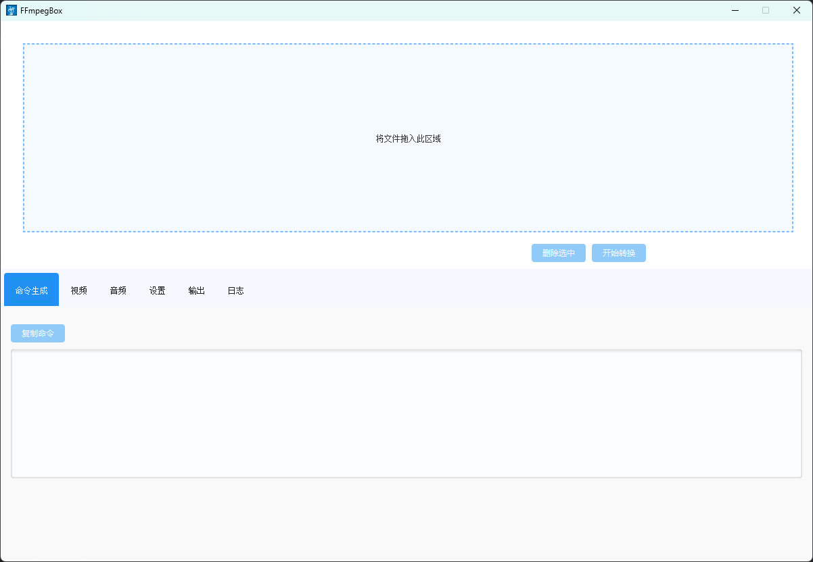

# FFmpegBox

🎬 A modern JavaFX-based GUI frontend for FFmpeg, enabling batch video/audio transcoding, resolution/bitrate customization, and stream separation with ease.

## ✨ Features

- Drag-and-drop video import
- Per-file format, resolution, and bitrate settings
- Audio/video-only output mode
- Realtime progress tracking for each task
- Command preview panel (one-click copy)
- Multi-threaded batch processing
- Persistent user settings (FFmpeg path)

## 📷 Interface Preview



## 🚀 Getting Started

1. Make sure Java 17+ is installed.
2. Download or clone this repository.
3. Run `MainApp.java` from your IDE or use `javafx:run` if using Maven.
4. First-time users need to set the FFmpeg executable path in Settings.

## 🔧 Tech Stack

- Java 17
- JavaFX
- MaterialFX (for modern UI components)
- FFmpeg (external dependency)

## 📂 Project Structure

- `MainController.java` — GUI logic and event binding
- `CommandBuilder.java` — Chainable FFmpeg command generator
- `FFmpegController.java` — Process execution and progress parsing
- `FileTask.java` — Model class for each transcoding job
- `style.css` — Light blue UI theme
- `MainView.fxml` — Main layout file

## 🗃️ Sample Command Preview

```bash
ffmpeg -y -i input.mp4 -vn -s 1280x720 -b:v 1000k -f mp3 ./output/input_audio.mp3
